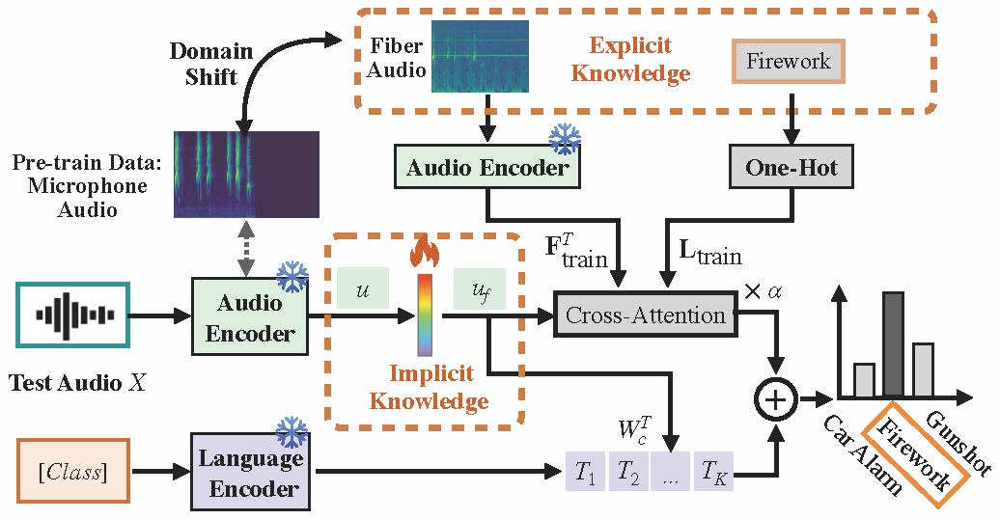

# CLAP-S: Support Set-Based Adaption for Fiber-Optic Acoustic Recognition



## 1 Dataset Preparation

Run the following command to generate the processed fiber_gunshot and coil_gunshot data. Note that you do not need to use the high pass filter.
```bash
 python outdoor_fiber_data_preprocess.py 
```

## 2 Run the CLAP-Support Set 
This command runs the CLAP-Support on the recorded ESC50 dataset. You can modify the dataset and random seed.

```bash
sh clap-support.sh 
```

This command runs the CLAP-Support on the ourdoor fiber dataset. You need to change the Dataloader of ESC in Line486-488 to Fiber in the `clap-support.py`, and then you are able to run the command below:

```bash
sh clap-support2.sh 
```

## 3 Parsing results
This command allows you to quickly calculate the average accuracy and variance across five random seeds for all datasets. You only need to modify the log reading path in `analysis_result_support.py`, and it will compute all the accuracies from the logs and save them in the `result` folder.

```bash
python analysis_result_support.py
```

## Contact
If you have any questions regarding this repo, please contact Jingchen Sun (jsun39@buffalo.edu).
