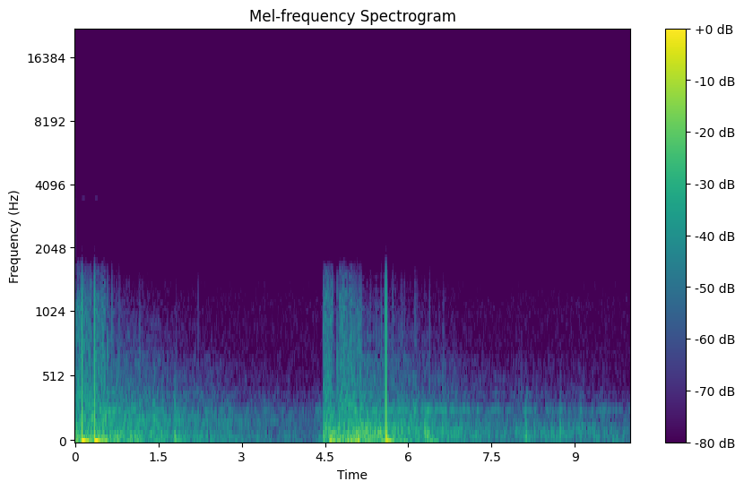

<div align="center">
<h1> CLAP-S: Support Set-Based Adaptation for Downstream Fiber-Optic Acoustic Recognition </h1>

[Jingchen Sun](https://jingchensun.github.io/)<sup>1, 2</sup>, [Shaobo Han](https://shaobohan.net/)<sup>1</sup>, [Wataru Kohno](https://scholar.google.es/citations?user=-o4nExgAAAAJ&hl=vi)<sup>1</sup>, [Changyou Chen](https://cse.buffalo.edu/~changyou/)<sup>2</sup>

<sup>1</sup>  NEC Labs America, USA  
<sup>2</sup>  University at Buffalo, The State University of New York, USA


[](https://github.com/Jingchensun/clap-s)
[](https://arxiv.org/abs/2501.09877) [](https://opensource.org/licenses/MIT)
</div>

## Introduction
This repository contains the code and dataset for our paper `CLAP-S: Support Set-Based Adaptation for Downstream Fiber-Optic Acoustic Recognition`. [[Paper](https://arxiv.org/abs/2501.09877)]


## Environment Installation
* Setup conda environment (recommended).
```bash
# Create a conda environment
conda create -n claps python=3.10 -y

# Activate the environment
conda activate clap

# Clone this repository
git clone git@github.com:Jingchensun/clap-s.git
cd clap-s
# Install torch
pip install -r requirement.txt
```

## 1 Dataset Preparation
### Outdoor Fiber Acoustic Dataset

<div style="text-align: center;">
  <p><a href="examples/train_367.wav">audio sample: Crackers</a></p>
  
</div>

Download the outdoor gunshot fiber dataset from [Google Drive](https://drive.google.com/drive/folders/1P45O415eiUN_Emp1ENTRkB5wcw2wCRos?ths=true) and extract them
```bash
tar -xvf coil_gunshot_resampled.tar.gz
tar -xvf fiber_gunshot_resampled.tar.gz
```

### Other Downstream Acoustic Dataset ESC50
We have demonstrated our algorithm using the publicly available ESC50 dataset. You can replace it easily with your own dataset. The proposed algorithms, CLAP-S and CLAP-S$^+$,  have been tested and can successfully run on ESC50 dataset. Below are the detailed instructions.

Download the ESC50 dataset
```bash
mkdir data
wget -c https://github.com/karoldvl/ESC-50/archive/master.zip
unzip master.zip
```

## 2 Run the CLAP-S
This command runs the CLAP-Support on the recorded ESC50 dataset. You can modify the dataset and random seed.

```bash
sh clap_support.sh 
```

## 3 Run the CLAP-S⁺ 
Before running CLAP-S⁺, you need to obtain the weights of the 'Adapter,' which consists of two MLP layers. Use the command below to train a few-shot Adapter and save the checkpoint.

```bash
sh clap_adapter.sh
```
After obtaining the Adapter checkpoint, you can train the trainable audio feature Adapter in CLAP-S. Note that this implicit Adapter is different from the explicit Adapter you trained earlier. This highlights a key insight of our method: leveraging the few-shot data twice.

```bash
sh clap_support_plus.sh
```
## 4 Experiment Result
| Method        | Shot-1 (%) | Shot-2 (%) |
|---------------|------------|------------|
| CLAP-S        | 90         | 93         |
| CLAP-S-F      | 94         | 94         |
| CLAP-S⁺       | 89         | 92         |
| CLAP-S⁺-F     | 94         | 94         |

Here are some results from ESC50, for your reference.

## Contact
If you have any questions regarding this repo, please contact Jingchen Sun (jsun39@buffalo.edu).

## Citing CLAP-S

If you find this repository useful, please consider giving a star :star: and citation

```
@article{sun2025clap,
  title={CLAP-S: Support Set Based Adaptation for Downstream Fiber-optic Acoustic Recognition},
  author={Sun, Jingchen and Han, Shaobo and Kohno, Wataru and Chen, Changyou},
  journal={arXiv preprint arXiv:2501.09877},
  year={2025}
}
```
