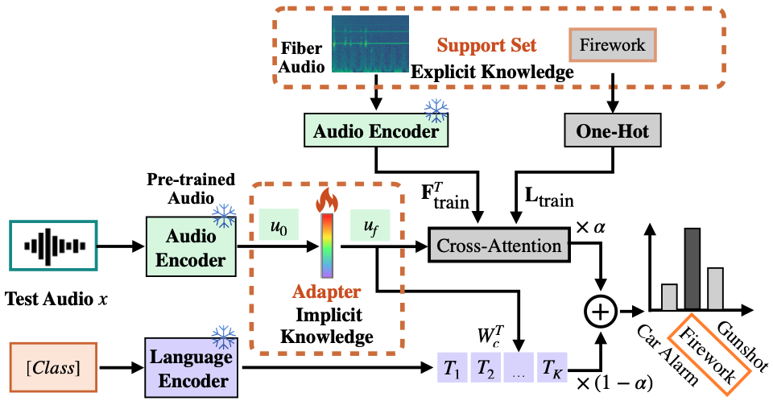

### [ICASSP 2025] CLAP-S: Support Set-Based Adaption for Fiber-Optic Acoustic Recognition


## Environment Installation
* Setup conda environment (recommended).
```bash
# Create a conda environment
conda create -n claps python=3.10 -y

# Activate the environment
conda activate clap

# Clone this repository
git clone git@github.com:Jingchensun/clap-s.git
cd clap-s
# Install torch
pip install -r requirement.txt
```

## 1 Dataset Preparation
Due to some commercial reasons, we are unable to release our fiber-optic acoustic dataset. However, we have demonstrated our algorithm using the publicly available ESC50 dataset. You can replace it easily with your own dataset. The proposed algorithms, CLAP-S and CLAP-S$^+$,  have been tested and can successfully run on ESC50 dataset. Below are the detailed instructions.

Download the ESC50 dataset
```bash
mkdir data
wget -c https://github.com/karoldvl/ESC-50/archive/master.zip
unzip master.zip
```

## 2 Run the CLAP-S
This command runs the CLAP-Support on the recorded ESC50 dataset. You can modify the dataset and random seed.

```bash
sh clap_support.sh 
```

## 3 Run the CLAP-S$^+$ 
Before running CLAP-S$^+$, you need to obtain the weights of the 'Adapter,' which consists of two MLP layers. Use the command below to train a few-shot Adapter and save the checkpoint.

```bash
sh clap_adapter.sh
```
After obtaining the Adapter checkpoint, you can train the trainable audio feature Adapter in CLAP-S. Note that this implicit Adapter is different from the explicit Adapter you trained earlier. This highlights a key insight of our method: leveraging the few-shot data twice.

```bash
sh clap_support_plus.sh
```
## 4 Experiment Result
| Method        | Shot-1 (%) | Shot-2 (%) |
|---------------|------------|------------|
| CLAP-S        | 90         | 93         |
| CLAP-S-F      | 94         | 94         |
| CLAP-S$^+$    | 89         | 92         |
| CLAP-S$^+$-F  | 94         | 94         |

Here are some results from ESC50, for your reference.

## Contact
If you have any questions regarding this repo, please contact Jingchen Sun (jsun39@buffalo.edu).

## Citing CLAP-S

If you find this repository useful, please consider giving a star :star: and citation

```
@article{sun2024claps,
  title={CLAP-S: Support Set-Based Adaption for Fiber-Optic Acoustic Recognition},
  author={Jingchen Sun, Shaobo Han, Wataru Kohno, Changyou Chen},
  journal={ICASSP},
  year={2025}
}
```
